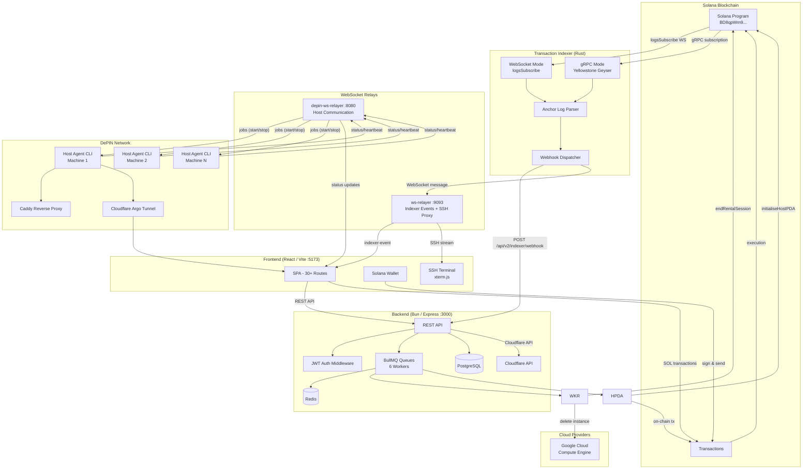
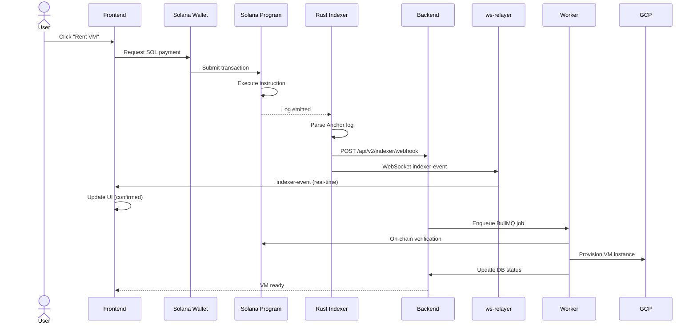
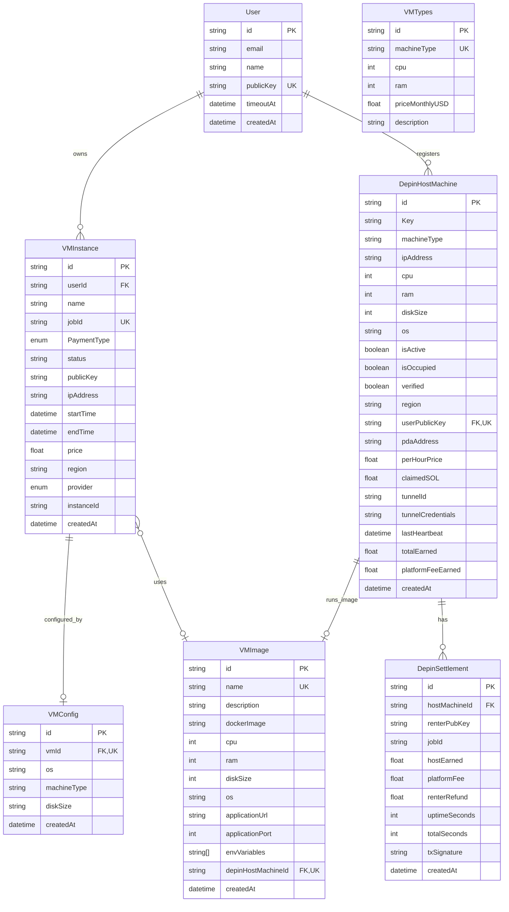

# Axion — Decentralized Cloud Computing Platform

[](https://opensource.org/licenses/MIT)
[](https://solana.com/)
[](https://www.anchor-lang.com/)
[](https://bun.sh/)
[](https://turbo.build/)

Axion is a two-sided decentralized cloud computing marketplace built on Solana.

**For Deployers** — Deploy Docker applications onto a global network of machines without managing servers, domains, or networking. Axion handles provisioning, reverse proxy (Caddy), HTTPS tunnels (Cloudflare Argo), and SOL-based billing automatically.

**For Hosts** — Turn idle machines into a source of income by joining the DePIN (Decentralized Physical Infrastructure Network). Earn SOL tokens for sharing compute resources, with on-chain reward settlements and automated SLA enforcement.

The platform combines Solana smart contracts, a Rust transaction indexer, Bun-based backend services, a React frontend with real-time WebSocket updates, and a host-agent CLI for DePIN machine registration and job execution.

---

## Table of Contents

- [Architecture Overview](#architecture-overview)
- [System Architecture Diagram](#system-architecture-diagram)
- [Transaction Flow](#transaction-flow)
- [Project Structure](#project-structure)
- [Tech Stack](#tech-stack)
- [Quick Start](#quick-start)
- [Environment Variables](#environment-variables)
- [API Reference](#api-reference)
- [Database Schema](#database-schema)
- [Smart Contracts](#smart-contracts)
- [Indexer](#indexer)
- [Host Agent](#host-agent)
- [Workers](#workers)
- [CI/CD](#cicd)
- [Deployment](#deployment)
- [Local Development](#local-development)
- [Testing](#testing)
- [License](#license)

---

## Architecture Overview

The platform consists of six core layers:

### 1. Smart Contract Layer (Solana / Anchor)
An Anchor program deployed on Solana managing:
- **VM Rentals** — escrow-based rental sessions with timed billing
- **DePIN Hosting** — host registration, activation, reward claims, penalties, and job settlement
- **Admin Vault** — centralized SOL management with fund flow control

16 instructions total (10 rental + 6 DePIN), each with Borsh-serialized arguments and CPI-safe account validation.

### 2. Transaction Indexer (Rust)
A high-performance on-chain monitor that:
- Subscribes to Solana logs via WebSocket (`logsSubscribe`) or Yellowstone gRPC
- Parses Anchor instruction signatures and Borsh arguments from log strings
- Pushes parsed events to both the backend API and the WebSocket relay simultaneously

### 3. Backend Services (Bun / Express)
A RESTful API server handling:
- **User authentication** — JWT-based signup/signin with wallet public key
- **VM lifecycle** — create, poll, read, terminate instances across GCP and DePIN providers
- **DePIN management** — host registration, verification, visibility, rewards, deployments
- **Indexer ingestion** — webhook receiver for on-chain events with deduplication
- **Background jobs** — 6 BullMQ worker queues for async operations (VM termination, host PDA init, status changes, DePIN settlements, reward claims, penalties)

### 4. WebSocket Relayers (Bun)
Two real-time communication servers:
- **ws-relayer** — broadcasts indexer events to frontend clients by public key subscription, proxies SSH terminal connections via ssh2
- **depin-ws-relayer** — manages DePIN host machine WebSocket connections, dispatches Docker job containers, monitors heartbeats (90s timeout triggers penalize)

### 5. Host Agent CLI (Bun)
A CLI tool running on DePIN host machines:
- **register** — interactively registers the machine as a DePIN host with the backend
- **start** — connects to depin-ws-relayer, sends heartbeats, executes Docker containers for deployed apps, manages Caddy reverse proxy routes and Cloudflare Argo tunnels

### 6. Frontend Application (React / Vite)
A single-page application with 30+ route pages providing:
- Landing page with 3D globe visualization (Three.js / three-globe)
- Dashboard for VM and host management
- Wallet-connected SOL payments
- Browser-based SSH terminal (xterm.js via WebSocket SSH proxy)
- DePIN deployment flow (find host, deploy Docker image, manage)
- Real-time updates via WebSocket subscriptions

---

## DePIN Network — Two-Sided Marketplace

### For Hosts: Earn from Idle Compute

Any machine with Docker can become a DePIN host:

1. **Install** — Run the one-liner host-agent CLI (`axion-host register`)
2. **Register** — Machine specs (CPU, RAM, disk, OS) are verified and stored on-chain via a Solana PDA
3. **Connect** — The agent opens a persistent WebSocket to Axion's depin-ws-relayer and sends heartbeats every 30s
4. **Earn** — When a deployer rents your machine, Docker containers are executed on it. SOL rewards accrue in real-time and are claimed on-chain. SLA violations (missed heartbeats, early shutdown) trigger automatic penalties via the smart contract
5. **Get Paid** — Claim earned SOL directly to your wallet at any time

The host never needs to configure DNS, TLS, or reverse proxies — the agent handles Caddy and Cloudflare Argo tunnels automatically.

### For Deployers: Deploy Without Infrastructure Worries

1. **Choose** — Browse available hosts or let Axion find one matching your resource requirements
2. **Deploy** — Specify a Docker image, environment variables, and port mappings via the frontend or API
3. **Access** — Axion automatically creates a Cloudflare Argo tunnel and a Caddy reverse proxy route on the host, giving you a public `https://` URL instantly
4. **Pay** — SOL is held in escrow and released proportionally to the host based on uptime. Any unused funds are refunded
5. **Manage** — Monitor usage, top up escrow, or terminate via the dashboard. Real-time WebSocket updates keep you informed

### Zero-Touch Networking

| Concern | How Axion Handles It |
|---------|---------------------|
| **Public URL** | Cloudflare Argo tunnel (cloudflared) — no open ports needed |
| **Reverse Proxy** | Caddy — auto TLS, virtual hosting per deployment |
| **DNS** | Cloudflare API — CNAME records created automatically |
| **HTTPS** | Cloudflare edge + Caddy auto certificates |
| **Container Execution** | Docker on the host, managed by the agent daemon |
| **Billing** | SOL escrow with on-chain settlement, proportional to uptime |

---

## System Architecture Diagram



---

## Transaction Flow



---

## Project Structure

```
Axion/
├── .github/workflows/              # GitHub Actions CI/CD
│   ├── ci.yml                      # Lint, build, detect changes, docker build & push
│   └── cd.yml                      # Update K8s deployment.yml image tags
│
├── contract/                        # Solana Anchor smart contracts
│   ├── programs/contract/
│   │   └── src/
│   │       ├── lib.rs              # Program entry: 16 instructions
│   │       ├── constants.rs        # ADMIN_PUBKEY constant
│   │       ├── errors.rs           # Custom Anchor errors (30) + DepinErrors (18)
│   │       ├── state/              # Account state structs
│   │       │   ├── vault_account.rs
│   │       │   ├── rental_session.rs
│   │       │   ├── escrow_session.rs
│   │       │   └── host_machine_registration.rs
│   │       ├── instructions/       # VM rental instructions (10)
│   │       │   ├── initialize_vault.rs
│   │       │   ├── transfer_to_vault_and_rent.rs
│   │       │   ├── transfer_from_vault.rs
│   │       │   ├── end_rental_session.rs
│   │       │   ├── fund_vault.rs
│   │       │   ├── withdraw_funds.rs
│   │       │   ├── start_rental_with_escrow.rs
│   │       │   ├── finalize_rental_escrow.rs
│   │       │   ├── top_up_escrow.rs
│   │       │   └── force_terminate_rental.rs
│   │       └── depin/              # DePIN host instructions (6)
│   │           ├── initialise_host_registration.rs
│   │           ├── activate_host.rs
│   │           ├── deactivate_host.rs
│   │           ├── claim_rewards.rs
│   │           ├── penalize_host.rs
│   │           └── settle_depin_job.rs
│   ├── tests/
│   │   ├── contract.ts            # Main test suite
│   │   └── depin_test.ts          # DePIN-specific tests
│   ├── Anchor.toml
│   └── Cargo.toml
│
├── indexer/                         # Rust transaction indexer
│   ├── Dockerfile                   # Multi-stage Rust build
│   ├── .env.example
│   └── src/
│       ├── main.rs                 # Entry: mode switching (WS / gRPC)
│       ├── config.rs               # Env configuration
│       ├── ws.rs                   # WebSocket logsSubscribe
│       ├── grpc.rs                 # Yellowstone gRPC (feature-gated)
│       ├── parser.rs               # Anchor log → ParsedEvent
│       ├── instructions.rs         # Instruction discriminators (15)
│       ├── args.rs                 # Borsh deserialization
│       └── notifier.rs             # Webhook dispatcher + WS relay
│
├── web-services/                    # Turborepo monorepo (Bun)
│   ├── package.json                # Root workspace config
│   ├── turbo.json                  # Pipeline: build, lint, check-types, dev
│   ├── bun.lock
│   │
│   ├── apps/
│   │   ├── backend/               # Express API server (:3000)
│   │   │   ├── index.ts           # App entry, rate limiters, graceful shutdown
│   │   │   ├── redis.ts           # BullMQ queue definitions (5 queues)
│   │   │   ├── routes/
│   │   │   │   ├── user.ts        # Auth: signup, login, profile, checkTimeout
│   │   │   │   ├── vm.ts          # Catalog: types, images, pricing, topup
│   │   │   │   ├── vmInstance.ts  # CRUD: create, poll, destroy, list, details
│   │   │   │   ├── depinVm.ts     # DePIN: register, verify, deploy, claim, settle
│   │   │   │   └── indexer.ts     # Webhook receiver, status
│   │   │   └── utils/
│   │   │       ├── calculatePrice.ts  # SOL/USD pricing via Jupiter API
│   │   │       ├── createVm.ts        # GCP instance provisioning
│   │   │       ├── deleteVm.ts        # GCP instance deletion
│   │   │       ├── cloudflare.ts      # Cloudflare tunnel & DNS API
│   │   │       └── helpers.ts         # Auth & response helpers
│   │   │
│   │   ├── frontend/              # React SPA (:5173)
│   │   │   ├── vite.config.ts
│   │   │   └── src/
│   │   │       ├── App.tsx        # 37 routes with lazy loading
│   │   │       ├── config.ts      # Env config
│   │   │       ├── pages/         # 30+ pages
│   │   │       │   ├── Landing.tsx, Dashboard.tsx, RentVm.tsx, vmDetail.tsx
│   │   │       │   ├── Hosting.tsx, Host.tsx, HostDashboard.tsx
│   │   │       │   ├── HostMachine.tsx, HostMachineDetails.tsx
│   │   │       │   ├── Signin.tsx, Signup.tsx, Profile.tsx
│   │   │       │   ├── Billing.tsx, Notifications.tsx
│   │   │       │   ├── Terminal.tsx, deployImage.tsx, DepinDeployment.tsx
│   │   │       │   ├── Admin.tsx, ApiReference.tsx, Docs.tsx
│   │   │       │   ├── Tutorials.tsx, TutorialPost.tsx
│   │   │       │   ├── Blog.tsx, Careers.tsx, Contact.tsx
│   │   │       │   ├── About.tsx, FAQ.tsx, Roadmap.tsx, Status.tsx
│   │   │       │   ├── Legal.tsx, ClaimRewards.tsx, NotFound.tsx
│   │   │       │   └── ...
│   │   │       ├── components/
│   │   │       │   ├── ui/        # shadcn primitives
│   │   │       │   ├── LandingPage/
│   │   │       │   ├── RentVm/
│   │   │       │   ├── vmDetail/
│   │   │       │   ├── DepinHostDashboard/
│   │   │       │   ├── DepinHosting/
│   │   │       │   └── DeployImage/
│   │   │       ├── hooks/         # useAuth, useHealth, useDebounce, useLoadingTimeout
│   │   │       └── lib/
│   │   │           ├── api.ts         # Axios client with interceptors
│   │   │           ├── contract.ts    # Anchor contract client
│   │   │           ├── useIndexerEvents.ts  # WS indexer hook
│   │   │           ├── useTxConfirm.ts      # Tx confirmation polling + WS
│   │   │           └── vm.ts, depin.ts, Escrow.ts
│   │   │
│   │   ├── worker/               # BullMQ background workers
│   │   │   ├── index.ts          # 6 workers + health server (:9094)
│   │   │   ├── contract.ts       # Server-side Anchor client
│   │   │   └── contractIdl.ts    # Inline IDL fallback
│   │   │
│   │   ├── ws-relayer/           # WebSocket relay + SSH proxy (:9093)
│   │   │   └── index.ts          # WS server, SSH via ssh2, event broadcast
│   │   │
│   │   ├── depin-ws-relayer/     # DePIN host WS relay (:8080)
│   │   │   └── index.ts          # Host mgmt, heartbeats, job dispatch
│   │   │
│   │   └── host-agent/           # DePIN host CLI tool
│   │       ├── index.ts          # CLI entry: "register" or "start"
│   │       ├── config.ts         # Config file mgmt (~/.axion/config.json)
│   │       ├── specs.ts          # System spec collection
│   │       ├── install.sh        # One-liner install script
│   │       ├── commands/
│   │       │   ├── register.ts   # Interactive host registration
│   │       │   └── start.ts      # Agent daemon (WS, heartbeats, Docker, Caddy, cloudflared)
│   │       └── utils/
│   │           ├── tunnel.ts     # cloudflared tunnel management
│   │           ├── caddy.ts      # Caddy reverse proxy routes
│   │           └── state.ts      # Job state persistence
│   │
│   └── packages/
│       ├── db/                   # Prisma ORM + PostgreSQL schema
│       ├── types/                # Shared Zod schemas
│       ├── ui/                   # Shared React components
│       ├── utilities/            # Auth, Redis, errors, response, logger, rate limiters
│       ├── eslint-config/
│       └── typescript-config/
│
├── ops/                           # Kubernetes manifests
│   ├── deployment.yml            # 7 deployments (frontend, backend, indexer, worker, ws-relayer, depin-ws-relayer, redis)
│   ├── service.yml               # ClusterIP services
│   ├── ingress.yml               # nginx ingress with 4 host rules + TLS
│   ├── certificate.yml           # cert-manager Let's Encrypt
│   ├── secrets.yml               # Base64 env vars + GCP key
│   ├── argocd.yml                # ArgoCD application
│   └── README.md                 # K8s deployment docs
│
├── docker/                        # Dockerfiles
│   ├── backend.dockerfile
│   ├── frontend.dockerfile
│   ├── worker.dockerfile
│   ├── ws-relayer.dockerfile
│   ├── depin-ws-relayer.dockerfile
│   └── nginx.frontend.conf
│
├── .husky/
│   └── pre-commit               # Enforces bun lockfile, runs lint-staged
├── .gitignore
├── LICENSE
└── README.md
```

---

## Tech Stack

| Layer | Technology |
|-------|-----------|
| **Blockchain** | Solana (devnet) |
| **Smart Contracts** | Anchor Framework 0.31 (Rust), Program ID: `BD8qpWm9WWLcqQu5PKJ3Lew4BZ6nh6n96FMZv3DJ54sc` |
| **Transaction Indexer** | Rust (tokio, solana-client 2.2, Yellowstone gRPC) |
| **Monorepo Manager** | Turborepo 2.5 |
| **Package Manager** | Bun 1.2.4 |
| **Backend Runtime** | Bun (Express 5) |
| **Database** | PostgreSQL 16 + Prisma 7 ORM |
| **Queue** | Redis 7 + BullMQ |
| **Frontend** | React 19 + TypeScript + Vite 7 |
| **Routing** | react-router-dom 7 (lazy-loaded routes) |
| **Styling** | TailwindCSS 4 + shadcn/ui (Radix primitives) |
| **Animations** | Motion / Framer Motion + Three.js / three-globe |
| **Terminal** | xterm.js + ssh2 (browser SSH proxy) |
| **Wallet** | @solana/web3.js 1.98 + @coral-xyz/anchor 0.31 |
| **Cloud Provider** | Google Cloud Compute Engine |
| **CDN / Tunnels** | Cloudflare (Argo tunnels, DNS API) |
| **Pricing** | Jupiter price API (SOL/USD) |
| **Containerization** | Docker (multi-stage Alpine builds) |
| **Orchestration** | Kubernetes (nginx-ingress + cert-manager) |
| **GitOps** | ArgoCD |
| **CI** | GitHub Actions (lint, build, docker push) |
| **CD** | GitHub Actions (automated K8s manifest updates) |
| **Code Quality** | ESLint, Prettier, Husky, lint-staged |

---

## Quick Start

### Prerequisites

- [Bun](https://bun.sh/) >= 1.2
- [Rust](https://rustup.rs/) >= 1.88 (for indexer)
- [Anchor CLI](https://www.anchor-lang.com/docs/installation) 0.31
- [Solana CLI](https://docs.solana.com/cli/install-solana-cli-tools)
- PostgreSQL >= 16
- Redis >= 7

### 1. Smart Contract

```bash
cd contract
anchor build
anchor deploy --provider.cluster devnet
# Update PROGRAM_ID in .env files
```

### 2. Database

```bash
cd web-services/packages/db
bun install
bunx prisma migrate dev
bunx prisma generate
```

### 3. Backend

```bash
cd web-services/apps/backend
bun install
cp .env.example .env     # Edit with your config
bun dev                  # :3000
```

### 4. Frontend

```bash
cd web-services/apps/frontend
bun install
cp .env.example .env
bun dev                  # :5173
```

### 5. WebSocket Relayer

```bash
cd web-services/apps/ws-relayer
bun install
bun dev                  # :9093
```

### 6. DePIN WS Relayer

```bash
cd web-services/apps/depin-ws-relayer
bun install
bun dev                  # :8080
```

### 7. Worker

```bash
cd web-services/apps/worker
bun install
bun run index.ts         # Starts 6 BullMQ workers + health server :9094
```

### 8. Transaction Indexer

```bash
cd indexer
cp .env.example .env
RUST_LOG=info cargo run  # WebSocket mode
# or with gRPC:
RUST_LOG=info cargo run --features grpc
```

---

## Environment Variables

### Backend

| Variable | Default | Description |
|----------|---------|-------------|
| `PORT` | `3000` | Server port |
| `DATABASE_URL` | — | PostgreSQL connection string |
| `REDIS_URL` | `redis://localhost:6379` | Redis connection |
| `JWT_SECRET` | — | JWT signing key |
| `SOLANA_RPC_URL` | `http://localhost:8899` | Solana JSON-RPC |
| `PROGRAM_ID` | — | Deployed Anchor program ID |
| `PRIVATE_KEY` | — | Admin wallet private key (base58) |
| `PROJECT_ID` | — | GCP project ID |
| `INDEXER_TOKEN` | `changeme` | Shared secret for indexer webhook auth |
| `ADMIN_KEY` | — | Admin Solana public key |
| `CLOUDFLARE_API_TOKEN` | — | Cloudflare API token |
| `CLOUDFLARE_ACCOUNT_ID` | — | Cloudflare account ID |
| `CLOUDFLARE_ZONE_ID` | — | Cloudflare zone ID |
| `CLOUDFLARE_DOMAIN` | `krishlabs.tech` | Cloudflare domain |
| `DEPIN_WS_URL` | `ws://localhost:8080` | DePIN WS relayer URL |
| `PLATFORM_VAULT_PUBKEY` | — | Platform vault pubkey for fee split |
| `PLATFORM_FEE_BPS` | `1000` | Platform fee in basis points (10%) |

### Frontend

| Variable | Default | Description |
|----------|---------|-------------|
| `VITE_BACKEND_URL` | `http://localhost:3000` | Backend API URL |
| `VITE_WS_RELAYER_URL` | `ws://localhost:9093` | WebSocket relay URL |
| `VITE_SOLANA_RPC_URL` | `http://localhost:8899` | Solana RPC endpoint |
| `VITE_PROGRAM_ID` | — | Anchor program ID |
| `VITE_ADMIN_KEY` | — | Admin Solana public key |

### Indexer

| Variable | Default | Description |
|----------|---------|-------------|
| `MODE` | `ws` | `ws` or `grpc` |
| `SOLANA_WS_URL` | `wss://api.devnet.solana.com` | Solana WebSocket endpoint |
| `SOLANA_HTTP_URL` | `https://api.devnet.solana.com` | Solana HTTP endpoint |
| `GRPC_ENDPOINT` | `http://127.0.0.1:10000` | Yellowstone gRPC endpoint |
| `PROGRAM_ID` | — | Program ID to monitor |
| `BACKEND_WEBHOOK_URL` | — | Backend webhook URL |
| `WS_RELAYER_URL` | — | ws-relayer URL |
| `INDEXER_TOKEN` | `changeme` | Shared secret for webhook auth |

### Worker

| Variable | Default | Description |
|----------|---------|-------------|
| `PRIVATE_KEY` | — | Admin wallet private key (base58) |
| `PROJECT_ID` | — | GCP project ID |
| `PLATFORM_VAULT_PUBKEY` | — | Platform vault pubkey |
| `PLATFORM_FEE_BPS` | `1000` | Platform fee basis points |
| `WS_URL` | `ws://localhost:8080` | DePIN WS relayer URL |
| `HEALTH_PORT` | `9094` | Worker health check server port |
| `DATABASE_URL` | — | PostgreSQL connection string |
| `REDIS_URL` | `redis://localhost:6379` | Redis connection |
| `SOLANA_RPC_URL` | `http://localhost:8899` | Solana JSON-RPC |
| `PROGRAM_ID` | — | Deployed Anchor program ID |

---

## API Reference

### Health

| Method | Path | Description |
|--------|------|-------------|
| `GET` | `/api/v2/health` | Basic health check (uptime) |
| `GET` | `/api/v2/ready` | Readiness check (DB + Redis status) |

### User Authentication

| Method | Path | Description |
|--------|------|-------------|
| `POST` | `/api/v2/user/signup` | Create account |
| `POST` | `/api/v2/user/login` | Authenticate |
| `GET` | `/api/v2/user/me` | Get profile (auth) |
| `GET` | `/api/v2/user/checkTimeout` | Check VM creation cooldown |

### VM Instances

| Method | Path | Description |
|--------|------|-------------|
| `POST` | `/api/v2/vmInstance/create` | Provision new VM (GCP) |
| `GET` | `/api/v2/vmInstance/pollStatus` | Poll VM provisioning status |
| `DELETE` | `/api/v2/vmInstance/destroy` | Terminate instance |
| `GET` | `/api/v2/vmInstance/getAll` | List user's instances |
| `GET` | `/api/v2/vmInstance/getDetails` | Get instance details |

### VM Catalog

| Method | Path | Description |
|--------|------|-------------|
| `GET` | `/api/v2/vm/calculatePrice` | Calculate SOL price for VM config |
| `GET` | `/api/v2/vm/getVMTypes` | Available VM machine types |
| `POST` | `/api/v2/vm/topup` | Top up escrow for running VM |
| `GET` | `/api/v2/vm/getAll` | List all VM images |
| `GET` | `/api/v2/vm/checkNameAvailability` | Check VM name availability |

### DePIN Host Management

| Method | Path | Description |
|--------|------|-------------|
| `POST` | `/api/v2/user/depin/register` | Register host machine |
| `POST` | `/api/v2/user/depin/changeVisibility` | Toggle host active/inactive |
| `GET` | `/api/v2/user/depin/getAll` | List all registered hosts |
| `GET` | `/api/v2/user/depin/getById/:id` | Get host details |
| `POST` | `/api/v2/user/depin/claimSOL` | Claim earned SOL rewards |
| `POST` | `/api/v2/user/depin/depinVerification` | Verify host machine specs |
| `POST` | `/api/v2/user/depin/findVM` | Find available host for deployment |
| `POST` | `/api/v2/user/depin/deploy` | Deploy Docker image to host |
| `DELETE` | `/api/v2/user/depin/terminate` | Terminate running deployment |
| `GET` | `/api/v2/user/depin/settlement/:id` | Get settlement details |

### Indexer Webhook

| Method | Path | Description |
|--------|------|-------------|
| `POST` | `/api/v2/indexer/webhook` | Receive parsed on-chain events |
| `GET` | `/api/v2/indexer/status` | Indexer health |

---

## Database Schema



---

## Smart Contracts

### Program ID (localnet / devnet)
```
BD8qpWm9WWLcqQu5PKJ3Lew4BZ6nh6n96FMZv3DJ54sc
```

### Instructions

#### VM Rental (10)

| # | Instruction | Description |
|---|-------------|-------------|
| 1 | `initialize_vault` | Create admin vault PDA |
| 2 | `transfer_to_vault_and_rent` | Deposit SOL + start rental session |
| 3 | `transfer_from_vault` | Settle payment + end rental |
| 4 | `end_rental_session` | Complete rental period |
| 5 | `fund_vault` | Top up admin vault |
| 6 | `withdraw_funds` | Withdraw from admin vault |
| 7 | `start_rental_with_escrow` | Begin escrow rental |
| 8 | `finalise_rental_with_escrow` | Settle escrow payment |
| 9 | `top_up_escrow` | Add funds to active escrow |
| 10 | `force_terminate_rental` | Admin-terminate rental |

#### DePIN Host (6)

| # | Instruction | Description |
|---|-------------|-------------|
| 11 | `initialise_host_registration` | Register host machine PDA |
| 12 | `activate_host` | Enable host for requests |
| 13 | `deactivate_host` | Disable host |
| 14 | `claim_rewards` | Withdraw earned SOL rewards |
| 15 | `penalize_host` | Deduct SOL for SLA violations |
| 16 | `settle_depin_job` | Settle DePIN job with host/platform fee split |

### State Accounts

| Account | Seeds | Fields |
|---------|-------|--------|
| `VaultAccount` | `b"vault"` | owner, bump |
| `RentalSession` | `b"rental", user, id` | user, id, amount, start_time, end_time, is_active |
| `EscrowSession` | `b"escrow", user, id` | user, host, id, amount, start_time, is_active |
| `HostMachineRegistration` | `b"host", host, id` | host, id, status, cpu, ram, disk, rewards_earned, last_claim |

---

## Indexer

The Rust indexer is the backbone of real-time transaction confirmation:

```
                         ┌──────────────┐
  Solana Validator ────▶│  logsSubscribe │
                         └──────┬───────┘
                                │ raw log
                                ▼
                         ┌──────────────┐
                         │   parser.rs   │
                         │ Anchor log →  │
                         │ ParsedEvent   │
                         └──────┬───────┘
                                │
                     ┌──────────┴──────────┐
                     ▼                     ▼
             ┌──────────────┐    ┌──────────────┐
             │  notifier.rs  │    │  notifier.rs  │
             │ POST to       │    │ WS send to    │
             │ backend       │    │ ws-relayer    │
             └──────────────┘    └──────────────┘
                     │                     │
                     ▼                     ▼
             ┌──────────────┐    ┌──────────────┐
             │   Backend    │    │  ws-relayer   │
             │ stores event │    │ broadcasts   │
             │ in DB        │    │ to frontend   │
             └──────────────┘    └──────────────┘
```

Features:
- Two transport modes: **WebSocket** (default, `logsSubscribe`) and **gRPC** (Yellowstone Geyser, `--features grpc`)
- Parses all 15 Anchor instruction discriminators from log strings
- Borsh-deserializes instruction arguments from raw transaction data
- Deduplicates events by signature (last 1000 entries)
- Dispatches to both backend webhook and ws-relayer simultaneously

---

## Host Agent

The host-agent CLI (`web-services/apps/host-agent`) runs on DePIN provider machines and manages the full lifecycle of a compute provider. It is the piece that makes hosting truly passive — once installed, everything from tunnel creation to container execution is automated.

### Commands

| Command | Description |
|---------|-------------|
| `axion-host register` | Interactive registration — collects system specs (CPU, RAM, disk, OS) and registers with the backend |
| `axion-host start` | Starts the agent daemon — connects to depin-ws-relayer, sends heartbeats every 30s, executes Docker containers for deployed apps, manages Caddy reverse proxy routes, creates Cloudflare Argo tunnels for HTTPS access |

### Zero-Touch Networking Flow

When a deployer rents a host machine, the agent handles everything transparently:

```
Deployer clicks "Deploy"
        │
        ▼
depin-ws-relayer sends "start-job" to host agent
        │
        ▼
host-agent pulls Docker image & starts container
        │
        ├── Caddy: adds reverse proxy route → localhost:PORT
        ├── cloudflared: creates Argo tunnel → Caddy
        └── Backend: creates Cloudflare DNS CNAME → tunnel
                │
                ▼
Deployer gets: https://<job-id>.axion.krishlabs.tech
```

The host never needs to open firewall ports, configure TLS, or manage DNS.

### Architecture

```
Host Machine
├── host-agent daemon
│   ├── WebSocket ↔ depin-ws-relayer
│   ├── Heartbeat (30s interval)
│   ├── Docker job execution
│   ├── Caddy route management
│   ├── cloudflared tunnel management
│   └── State persistence (~/.axion/state.json)
├── Caddy (reverse proxy, auto TLS per app)
└── cloudflared (Argo tunnel, no open ports needed)
```

### One-liner Install

```bash
curl -fsSL https://raw.githubusercontent.com/.../install.sh | bash
```

---

## Workers

6 BullMQ background workers run in the `worker` service, processing jobs from 5 Redis queues:

| Queue | Worker | Description |
|-------|--------|-------------|
| `vm-termination` | VM Termination | Ends Solana rental session + deletes GCP instance |
| `initialise-host-pda` | Host PDA Init | Creates on-chain HostMachineRegistration PDA |
| `changeVMStatus` | VM Status | Activates / deactivates host on-chain |
| `terminate-depin-vm` | DePIN Termination | Settles DePIN job on-chain + creates settlement record + frees host |
| `claim-rewards` | Claim Rewards | Claims earned SOL rewards for a host |
| `penalize-host` | Penalize Host | Deducts SOL for SLA violations (e.g., missed heartbeats) |

All workers connect to the DePIN WS relayer and share a health server on port `9094`.

---

## CI/CD

### GitHub Actions

#### CI (`ci.yml`)
Triggers on PR and push to `main` for paths in `web-services/` and `indexer/`:

1. **quality** — Sets up Bun 1.2.4, caches deps, runs `bun install`, `bun run lint`, `bun run build`
2. **detect-changes** — Uses `git diff` to identify which services changed (backend, frontend, worker, ws-relayer, depin-ws-relayer, indexer), uploads artifact
3. **docker-build** — On push to main, builds and pushes Docker images to Docker Hub for each changed service (tagged `latest` + `v1.2.{run_number}`)

#### CD (`cd.yml`)
Triggered by successful CI run on main:
- Downloads the changed-services artifact
- Updates `ops/deployment.yml` image tags via `sed`
- Commits and pushes the updated manifest back to `main`

### ArgoCD

An ArgoCD application manifest is included in `ops/argocd.yml` for GitOps-based deployment to Kubernetes.

---

## Deployment

### Docker Images

All Bun-based services use multi-stage builds on `oven/bun:alpine`. The indexer uses `rust:slim-bookworm`.

| Service | Docker Hub Image | Dockerfile |
|---------|-----------------|-----------|
| Backend | `krishanand01/axion-backend` | `docker/backend.dockerfile` |
| Frontend | `krishanand01/axion-frontend` | `docker/frontend.dockerfile` |
| Worker | `krishanand01/axion-worker` | `docker/worker.dockerfile` |
| WS Relayer | `krishanand01/axion-ws-relayer` | `docker/ws-relayer.dockerfile` |
| DePIN WS | `krishanand01/axion-depin-ws-relayer` | `docker/depin-ws-relayer.dockerfile` |
| Indexer | `krishanand01/axion-indexer` | `indexer/Dockerfile` |

### Kubernetes

```bash
# Apply all manifests
kubectl apply -f ops/

# Verify
kubectl get pods -n axion
kubectl get ingress -n axion
```

### Domains

| URL | Service |
|-----|---------|
| `https://axion.krishlabs.tech` | Frontend |
| `https://api.axion.krishlabs.tech` | Backend API |
| `wss://wss.axion.krishlabs.tech` | WebSocket relay |
| `wss://wss.depin.axion.krishlabs.tech` | DePIN WS relay |

---

## Local Development

### Full Local Stack

```bash
# Terminal 1: Solana test validator
solana-test-validator
# airdrop SOL: solana airdrop 100 <ADMIN_WALLET> --url http://localhost:8899

# Terminal 2: Backend
cd web-services/apps/backend && bun dev

# Terminal 3: Frontend
cd web-services/apps/frontend && bun dev

# Terminal 4: WS Relayer
cd web-services/apps/ws-relayer && bun dev

# Terminal 5: Depin WS Relayer
cd web-services/apps/depin-ws-relayer && bun dev

# Terminal 6: Worker
cd web-services/apps/worker && bun run index.ts

# Terminal 7: Indexer
cd indexer && RUST_LOG=info cargo run

# Services needed: PostgreSQL (port 5432), Redis (port 6379)
```

### Monorepo Commands

```bash
# From web-services/
bun install                  # Install all workspace deps
turbo build                  # Build all packages + apps
turbo dev                    # Start all in dev mode
turbo lint                   # Lint all (except worker)
turbo lint --filter=frontend # Lint specific app
turbo build --filter=backend # Build specific app
```

---

## Testing

```bash
# Smart Contract tests
cd contract && anchor test

# Frontend (if configured)
cd web-services/apps/frontend && bun run test

# Backend
cd web-services/apps/backend && bun run test
```

---

## License

MIT — see [LICENSE](LICENSE).

Copyright 2026 Krish Anand
